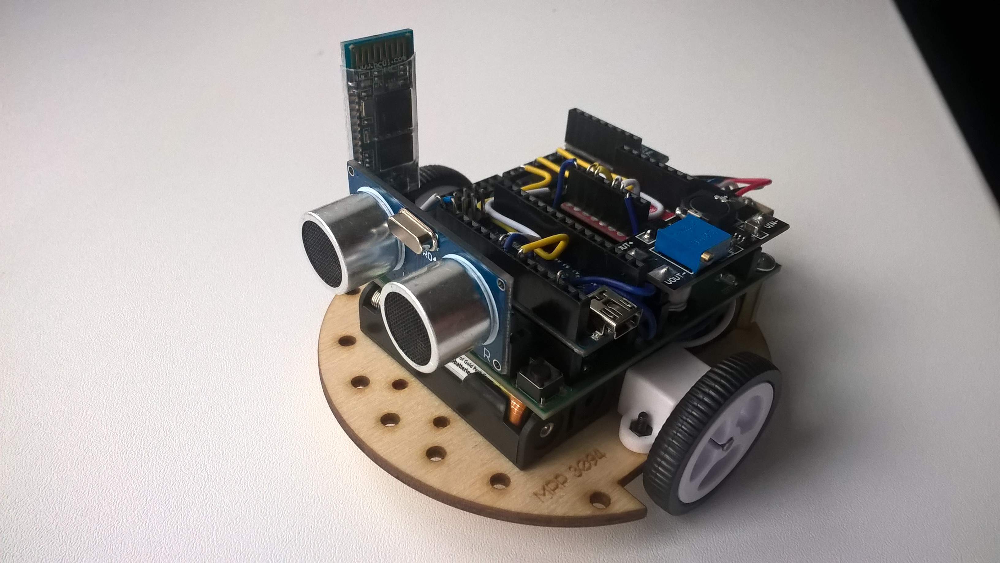

= Познаём робота вместе
:icons: font
:toc: left

== Подготовка
Текущие задания выполняются на мобильном роботе МРП309, но можно использовать и другие устройства семейства Arduino.

.Мобильный робот МРП309

.Прототипы мобильного робота
image::pictures/IMG_7309.JPG[500, 500, align="center"]

:arduinoide: https://www.arduino.cc/en/main/software#
Для программирования мобильного робота тебе понадобится среда разработки Arduino IDE, которую можно скачать здесь {arduinoide}

Запускаем Arduino IDE. Перед тобой открывается окно. В центре окна расположен *скетч* для написания кода (программы).

[WARNING]
Перед использованием Arduino IDE необходимо выполнить выбор порта загрузки, платы и микроконтроллера,
заходим в:

****
1.Инструменты => Плата. Выбираем Arduino Nano;

2.Инструменты => Процессор. Выбираем ATMega328;

3.Инструменты => Порт. Выбираем тот, которому соответствует наша подключенная плата, у меня это COM5.
****

Рассмотрим меню, которое расположено над скетчем.Когда ты напишешь свой код, необходимо убедится в том, что ты не сделал грубых ошибок. Эту проверку можно выполнить с помощью клавиши *Проверить*. Если проверка пройдет успешно, тогда можно смело загружать нашу программу на плату, при помощи клавиши *Загрузить*.

.Рабочее окно Arduino IDE
image::pictures/ArduinoIDE.png[500, 500]

== Урок 1. Знакомство со светодиодом
В данном уроке ты заставишь светодиод мигать.

TIP: Светодиод — это полупроводниковый прибор, трансформирующий электроток в видимое свечение.

.Внешний вид светодиода
image::pictures/1.1.jpg[300, 300]

У светодиода есть два контакта: отрицательный - *катод* и положительный - *анод*.

.Обозначение светодиода на схеме
image::pictures/1.2.1.luminodeode.jpg[300, 300]

WARNING: Чтобы светодиод не сгорел, он включается в схему через резистор. Резистор подключается к положительному (аноду) контакту светодиода.
Важно подобрать правильный номинал резистора.

.Схема включения светодиода через резистор
image::pictures/1.2.2.luminodeode.jpg[300, 300]

=== Расчет номинала резистора

Чтобы светодиод работал исправно, а не сгорел при первом подключении его к питанию,
 необходимо правильно подобрать номинал резистора. Резистор будет забирать излишнее напряжение.

Расчет номинала резистора выполняется по формуле, взятой из закона Ома.

R=(V~s~-V~l~)/I

* R - сопротивление резистора (измеряется в Омах (Ом));
* V~s~ - напряжение источника питания (измеряется в Вольтах (В));
* V~l~ - напряжение светодиода (В);
* I - ток светодиода (ток измеряется в Амперах (А)).

Рассмотрим пример:

Напряжение источника питания 5 В. Напряжение светодиода 2 В.
Максимальной электрический ток для светодиода 20 мА. (20 мА = 0,02 А).
Подставив данные значения в формулу, ты получишь сопротивление, необходимое для резистора:

R=(5-2)/0.02=150 Ом

Получается для того, чтобы светодиод не сгорел в данной цепи нужно выбрать номинал резистора с сопротивлением не менее 150 Ом. Лучше взять больше, про запас.
Возьмем например резистор, номиналом 220 Ом (номинал резисторов можно посмотреть в таблице номиналов).

Кстати,с помощью резистора можно регулировать яркость светодиода.
Чем больше сопротивление на резисторе, тем менее ярким будет светодиод.

=== Ход работы

1. Установи Arduino Nano на кросс-плату;
2. Подключи светодиод. На кросс-плате их два (синий и красный), находятся в передней части кросс-платы. Выбери любой. Плюс светодиода подсоедини к пину D13 платы Arduino Nano, Минус светодиода подсоедини к любому  минусу контактной колодки. Как правило, контакт «плюс» соединяют красным проводом, «минус» – черным.;
+
.Схема подключения светодиода к плате
image::pictures/1.2.3.luminodeode.jpg[700, 700]

3. Подключи устройство к компьютеру через последовательный порт и загрузи на него код:
+
....
//Код, позволяющий мигать светодиодом

void setup()
{
  pinMode(13, OUTPUT);         // Задаем пин 13 как выход
}

void loop()
{
  digitalWrite(13, HIGH);      // Включаем светодиод
  delay(1000);                 // Ждем одну секунду
  digitalWrite(13, LOW);       // Выключаем светодиод
  delay(1000);                 // Ждем одну секунду
}
....

Успех! Светодиод стал мигать с периодичностью в 1 секунду.
Изменяя значение внутри функции delay() (задержка), мы можем регулировать частоту миганий. В нашем случае установлено значение 1000 мс (миллисекунд), что соответствует 1 секунде.

Давай рассмотрим нашу программу подробнее.

TIP: В любом скетче Arduino IDE должны присутствовать две функции *setup()* и *loop()*, иначе при проверке кода вылезет ошибка.

* *setup()* - это функция с настройками микроконтроллера. Она выполняется единожды в начале программы при включении микроконтроллера.
В теле этой функции указываются параметры настройки, например выбор пина, который используется на плате.
* *loop()* - это функция выполнения. Она циклична, То есть все то, что находится в теле этой функции (внутри фигурных скобок {}) непрерывно повторяется. В этой функции описываются основные действия нашей программы.
* *void* - Это ключевое слово, определяемое тип данных, которое возвращает функция. *void* означает, что функция не возвращает никаких значений.

....
pinMode(13, OUTPUT);         // Задаем пин 13 как выход
....

* *pinMode()* - это процедура, которая устанавливает определенный пин в соответствующий режим;
* *13* - номер пина, к которому подключен светодиод;
* *OUTPUT* - режим, в который мы устанавливаем наш пин. В нашем случае пин определен как выход. Это значит что информационный сигнал будет передоваться из этого пина на светодиод.

....
digitalWrite(13, HIGH);      // Включаем светодиод
....

* *digitalWrite()* - это функция, которая подает определенный уровень напряжения на *цифровой* пин. Либо LOW - низкий, либо HIGH - высокий;
* *13* - номер пина, к которому подключен светодиод;
* *LOW* - низкий уровень напряжения, который соответствует значению, 0 Вольт;
* *HIGH* - высокий уровень напряжения, соответствует значению, 5 Вольт.

....
delay(1000);                 // Ждем одну секунду
....

* *delay()* - функция, останавливающая выполнение программы на заданное количество миллисекунд (1000 мс = 1 с).

Молодец, а теперь попробуй выполнить задания.

=== Задания

1. Отредактируй программу таким образом, чтобы светодиод мигал с периодичностью в :

** 2 секунды;
** 5 секунд;
** 1/2 секунды.

2. Отредактируй программу так, чтобы светодиод горел постоянно.

3. Теперь сделай так, чтобы светодиод не горел (соответственно сама плата должна быть подключена к питанию).

4. Рассчитай сопротивление резистора, для цепи с напряжением питания, равным 9 В,
Напряжение светодиода 2 В, с максимально допустимым током 25 мА.

== Урок 2. Знакомство с кнопкой

В данном уроке ты научишься использовать кнопку для управления светодиодом.

TIP: Кнопка - это простой механизм, замыкающий цепь. Пока кнопка нажата - цепь замкнута, кнопка опущена - цепь разомкнута.

.Внешний вид тактовой кнопки
image::pictures/2.1.button.jpg[300, 300]

.Обозначение кнопки на схеме (слева с одной парой контактов, справа с двумя парами контактов)

Рассмотрим схему, представленную ниже:

.Схема подключения кнопки через стягивающий резистор
image::pictures/2.2.2.button.jpg[300, 300]

В этой схеме сигнал идет с источника питания через кнопку и попадает в плату Arduino Nano черезе пин D12,
в дальнейшем микроконтроллер обрабатывает этот сигнал и посылает сигнал на пин D13,
к которому подключен светодиод. Резистор в схеме играет роль *стягивающего*, который забирает излишки тока в землю.
На нашей кросс-плате к кнопке уже подключен данный резистор. Его номинал составляет 10 кОм.

Реализуем данную схему в ходе работы.

=== Стягивающий  резистор
Используются в схемах, рядом с контактами логических компонентов, где важно только 2 факта:
есть на контакте питание или нет. Например контакты Arduino.
Задача этих резисторов - не оставить контакт компонента в "подвешенном" состоянии.

Рассмотрим схему без стягивающего резистора

.Схема подключения светодиода через кнопку
image::pictures/2.2.3.buttonNotRezistor.jpg[300, 300]

Мы хотим, чтобы когда кнопка была не нажата, светодиод не горел (цифровой вход фиксировал отсутствие сигнала).
Но в данном случае наш вход то срабатывает, то не срабатывает в хаотическом состоянии (Светодиод может тускло гореть).
Причина этого — шумы. Которые возникают из различных воздействий окружающей среды. Провода действуют как антенны и производят электричество из электромагнитных волн среды.
Чтобы гарантировать отсутствие напряжения при разомкнутой цепи, рядом со светодиодом (либо любым другим цифровым входом платы) ставится стягивающий резистор:

.Схема подключения светодиода через кнопку с использованием стягивающего резистора
image::pictures/2.2.4.buttonRezistor.jpg[300, 300]

Теперь нам не будут мешать шумы. При нажатии на кнопку светодиод будет гореть, а при не нажатии гарантированно погаснет.

TIP: Как правило сопротивление стягивающего резистора не менее 10 кОм.

=== Оператор if...else
Конструкция *if...else* позволяет в программе выполнять проверку условия
и задавать варианты дальнейшего ее решения.

Синтаксис этой конструкции таков:
....
if (условие)       // Проверяется указанное условие
{
  // Действие A
}
else                           // Иначе
{
  // Действие B
....

Если *условие* будет верным, то программы перейдет к *Действию A*, а *Действие B* проигнорирует.

Если условие - *неверное*, то программа будет выполнять *Действие B*, а *Действие A* - игнорировать.

=== Ход работы

1. Установи Arduino Nano на кросс-плату;
2. Подключи кнопку и светодиод, как показано на рисунке.
+
.Схема подключения кнопки и светодиода к плате
image::pictures/2.3.buttonLuminodeode.jpg[700, 700]

3. Подключи устройство к компьютеру через последовательный порт и загрузи на него код:
+
....
// Код для включения светодиода с помощью кнопки

int buttonPin = 12;           // Назначаем пин с кнопкой
int ledPin = 13;              // Назначаем пин со светодиодом
boolean buttonState = LOW;    // Состояние кнопки отжата

void setup()
{
  pinMode(buttonPin, INPUT); // Задаем пин с кнопкой как вход,
  pinMode(ledPin, OUTPUT);   // а пин со светодиодом - как выход
}

void loop()
{
  // Считываем значение кнопки
  buttonState = digitalRead(buttonPin);
  if (buttonState == HIGH)       // Если кнопка нажата
  {
    digitalWrite(ledPin, HIGH);  // Включаем светодиод
  }
  else                           // Иначе
  {
    digitalWrite(ledPin, LOW);   // Выключаем светодиод
  }
}
....

4. Теперь нажми и удерживай кнопку. Если ты все делал по указаниям, то при нажатии на кнопку светодиод должен загораться, а при отпускании кнопки - гаснуть.

Когда ты нажимаешь на кнопку, ты замыкаешь цепь и электрический ток поступает на пин D12, в дальнейшем наша программа обрабатывает этот сигнал и подает высокий уровень напряжения на пин D13, к которому подключен светодиод.

Давай рассмотрим нашу программу подробнее.

Часть функций ты видел в xref:Урок 1. Знакомство со светодиодом[уроке 1]

....
int buttonPin = 12;           // Назначаем пин с кнопкой
....

Данной строчкой мы создаем глобальную переменную с именем *buttonPin*, типа *int* (integer - целый тип данных) и присваиваем ей значение *12*.
Имя переменной может быть любым, но понятным для тебя. Значение должно соответствовать пину, который ты выбрал, а тип переменной мы выбрали целый по причине того, что пины на плате обозначаются целыми числами (12, 13, 14 и тп.), а не дробными (0,5, 0,8 и тп.).

TIP: В программе каждая переменная имеет имя, тип данных и значение.

TIP: *Глобальные переменные* - это переменные, которые доступны всей программе, включая подпрограммы (пользовательские функции). *Локальные переменные* - переменные, определенные внутри подпрограммы (пользовательской функции). Они доступны только внутри функции, в которой они определены.

....
boolean buttonState = LOW;    // Состояние кнопки отжата
....

Переменная *buttonState* необходима нам для того, чтобы отследить состояние нашей кнопки. У нее может быть 2 состояния: нажата и отжата.
Поэтому мы создаем переменную типа *boolean* c начальным значением *LOW* (в ходе программы это значение будет изменяться).

* *boolean* - тип данных, принимающий всего два возможных значения (true (истина) или false (ложь); 1 или 0; LOW (низкий уровень напряжения) или HIGH (высокий уровень напряжения))

....
pinMode(buttonPin, INPUT); // Задаем пин с кнопкой как вход
....

* *pinMode()* - это процедура, которая устанавливает определенный пин в соответствующий режим;
* *buttonPin* - имя пина, к которому подключен светодиод. В xref:Урок 1. Знакомство со светодиодом[уроке 1] мы не задавали имя пину, а писали просто номер пина. Правильнее задавать имя для всех переменных;
* *INPUT* - режим, в который мы устанавливаем наш пин. В нашем случае пин определен как *вход*. Это значит что информационный сигнал будет передаваться из вне на этот пин;

....
buttonState = digitalRead(buttonPin);
....

С помощью функции *digitalRead()*, программа считывает значение с переменной *buttonPin* и присваивает его нашей переменной *buttonState*.

* *digitalRead()* - функция, считывающая значение с указанного пина. Возвращает либо LOW, либо HIGH;

....
if (buttonState == HIGH)       // Если кнопка нажата
{
  digitalWrite(ledPin, HIGH);  // Включаем светодиод
}
else                           // Иначе
{
  digitalWrite(ledPin, LOW);   // Выключаем светодиод
}
....

В данном месте программы мы проверяем состояние кнопки: нажата или нет. Используем при этом конструкцию *if, else*

Молодец, теперь ты знаешь как с помощью кнопки замыкать и размыкать электрическую цепь.
Вместо светодиода могут быть подсоединены и другие устройства, например пищалка (пьезоэлемент).

=== Задания
1. Поправь программу так, чтобы при опущенной кнопке светодиод горел, а при нажатой нет.

2. Поправь программу так, чтобы при опущенной кнопке светодиод горел, а при нажатой мигал с периодичностью в 1 секунду.
(Смотри xref:Урок 1. Знакомство со светодиодом[урок 1]).

3. Поправь программу так, чтобы при нажатии на кнопку светодиод мигал, а при
отпущенной кнопке нет.

4. Подсоедини в схему вместо светодиода пищалку (пьезоэлемент).
Что произошло?

== Урок 3. Знакомство с пищалкой (пьезоэлемент)

TIP: Пьезоэлемент - это

== Урок 4. Передача информации с мобильного робота на компьютер через последовательный порт
В ходе данной работы ты научишься передавать сигналы с компьютера на робота и
наоборот через проводной последовательный порт.

Это может потребоваться при управлении роботом с помощью клавиатуры, мыши или смартфона.

TIP: *Последовательный порт (COM-порт, Serial Port*)
 – это стандартный двунаправленный последовательный порт компьютера,
 используется для передачи данных согласно *протоколу RS-232* и не только.

TIP: *Протокол передачи данных* — стандарт, описывающий правила взаимодействия
функциональных блоков при передаче данных.

То есть протокол - набор правил, по которым будут общаться устройства.

NOTE: *RS-232 (Recommended Standard 232)* – это протокол
последовательной передачи данных между двумя устройствами
(информация передается пакетами по одному байту). Согласно данному протоколу,
информация передается у виде двоичного кода: логическому нулю соответствует
значение напряжение со знаком “+”, а логической единице соответствует
значение напряжения со знаком “–“.

=== Ход работы
1. Установи Arduino Nano на кросс-плату.
+
.Установка Nano в кросс-плату
image::pictures/4.1.comPrintln.jpg[700, 700]

2. Подключи устройство к компьютеру через последовательный порт и загрузи на него код.
Поскольку общение будет происходить через порт, важно *не отсоединять* провод от платы.
+
....
// Общение с компьютером через последовательный порт

void setup()
{
  // Определяем последовательный порт
  // Задаем скорость передачи данных 9600 бод
  Serial.begin(9600);

  // Отправляем по последовательному порту
  // сообщение "Hello"
  Serial.println("Hello");
}

void loop()
{
  // Проверка, пришла ли какая-нибудь
  // информация с компьютера
  if (Serial.available() > 0)
  {
    // Пришла. Считываем ее в переменную b
    byte b = Serial.read();
    // Отправлем ответную информацию на компьютер
    Serial.write(b);
  }
}
....
+
3. Открой Arduino IDE и зайди в:
+
****
Сервис => Монитор порта
****
Перед тобой откроется диалоговое окно для передачи символов через последовательный порт.
Робот будет приветствовать тебя фразой 'Hello', что в переводе с Английского значит 'Привет'.
+
.Монитор порта. Приветствие
image::pictures/4.2.1.monitorPort.jpg[700, 700]
+
4. Поставь курсор мыши в поле ввода, напиши любой текст и нажми *отправить*.
+
.Монитор порта. Ввод текста
image::pictures/4.2.2.monitorPort.jpg[700, 700]
+
.Монитор порта. Вывод введенного текста
image::pictures/4.2.3.monitorPort.jpg[700, 700]
+
После того, как ты нажал отправить, текст через последовательный порт
передался на контроллер, контроллер его обработал и отправил в монитор порта абсолютно такой же текст.
Таким вот простым образом можно производить передачу данных с компьютера на контроллер и наоборот.
+
*Рассмотрим код программы подробнее:*
+
* Про функции *setup()* и *loop()* ты знаешь из xref:Урок 1. Знакомство со светодиодом[урока 1];
* Оператор *if* тебе известен из xref:Урок 2. Знакомство с кнопкой[урока 2];
* *Serial.begin(9600)* -
+
5. Теперь создадим диалог между тобой и контроллером робота.
Смысл диалога состоит в том, что ты будешь писать роботу вопросы, а он будет тебе отвечать.
+
IMPORTANT: В данном задании важно задавать вопросы в точности также, как мы их опишем в программе, учитывая все знаки препинания
и заглавные буквы!
